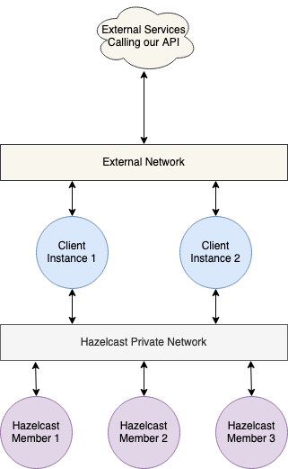

# hazelcast-docker

I was interested in running Hazelcast OSS as a distributed In Memory Cache. Reading up on existing blogs and guidance on Hazelcast, I realised that Hazelcast OSS provides limited features for security in the Open Source version. Anyone with access to the Hazelcast cluster ports is free to read/write data on the cluster.

In order to provide some degree of protection to the hazelcast cluster it was therefore essential to network isolate the cluster members such that only authorised users/clients could access it. Therefore I started to look at putting up multiple Hazelcast instances in docker and realised even here the existing blogs and guides on getting multiple containersed Hazelcast instances need updates. The key issue I found with existing blogs was in getting Hazelcast cluster members connecting with each other. It felt like it was time to do an updated version of Hazelcast in Docker Swarm.

The idea is to deploy Hazelcast in Docker as a swarm service such that the cluster members talk to each other on an internal overlay network. Any authorised client(s) for the cluster can then be deployed such that the clients are also attached to the private overlay network. Clients could also have a second network attached with ingress enabled such that they could provide a service which uses Hazelcast IMDG as a backend to store data in memory.

## References

* [Hazelcast IMDG Official Docker Images](https://hub.docker.com/r/hazelcast/hazelcast)
* [Hazelcast Management Centre Official Docker Images](https://hub.docker.com/r/hazelcast/hazelcast-jet-management-center)
* [Docker Compose v3.8 or above](https://docs.docker.com/compose/compose-file/)

## Dependencies:

* Docker CE v 19.03 or higher
* Docker Compose v3.8
* Vagrant and Virtualbox (If you want to bring up an isolated environment for this on your local machine)

## Docker Swarm based Network Isolated Hazelcast

### Run Hazelcast OSS on a private overlay network in Docker Swarm

#### Hazelcast V4 deployed in a network isolated 3 member cluster

[Hazelcast V4 Specific Instructions](./hazelcast-v4/hazelcastv4-deploy.md)

#### Hazelcast V3 deployed in a network isolated 3 member cluster
[Hazelcast V3 Specific Instructions](./hazelcast-v3/hazelcastv3-deploy.md)

The diagrams in this repo where drawn using the services of [Draw.io](https://www.draw.io/)
